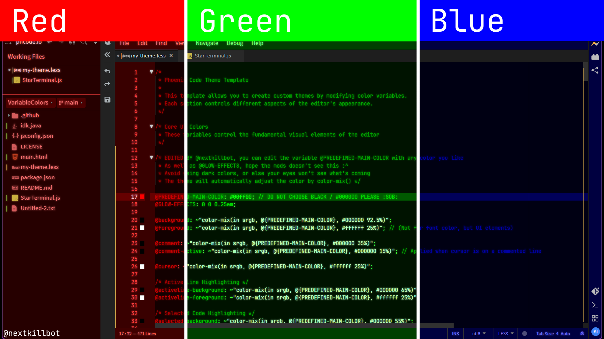

# Preview:

# Okay? How do I even edit these colors for my own personal stuff

1) Just clone my repository into your own, on the main menu, click the green button that says "Code"
2) There'll be a dropdown, just download it as a .zip file
3) Head over to this <a href="https://github.com/phcode-dev/theme-template" target="_blank">website (Click me...)</a>
4) Click "Use the template", there'll be a dropdown, just click "Create a new repository"
5) Input the information given to you, like the title and etc
6) Next, head over to your Downloads folder, go to `my-theme.less` and read the comment notes. Read it very carefully or else idk what will happen `¯\_(ツ)_/¯`
7) Make sure you're signed in to GitHub, since if you wanna use it, you'll have to edit `package.json`. Please remove my own syntaxes for explaining ways to format your info
8) Compress the folder (make sure it's not all the contents like `README.md`, `package.json` and so), you will have to compress it by the folder that contains those files
9) Rename it to `extension.zip`
10) On your repository, create a new release, as well as a tag that's the same versioning scheme in `package.json`
11) Publish it, check your repository issues after this
12) Wait until a bot shows up, and then just do what it says

Note: Any problems? Just create a new issue and I'll give you potential solutions :)
